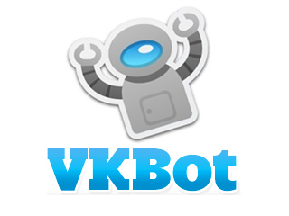
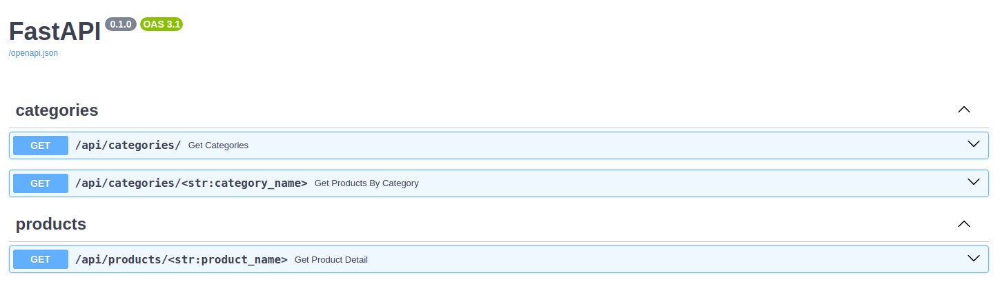

<div style="text-align: center;">

<h1 style="text-align: center">Витрина для онлайн продажи из социальных сетей ВКонтакте.</h1>
</div>

###  Описание приложения.
Этот проект представляет собой чат-бот для социальной сети ВКонтакте, 
который помогает пользователям просматривать различные 
продукты и услуги. 

Бот может использоваться как платформа для демонстрации и продажи 
различных цифровых товаров, таких как скрипты, плагины, веб-сайты 
и другие не только.

Проект разделён на бекэнд, реализован на связке сервера FastApi и
базы данных Postgres. Фронтэнд реализован с помощью VK_API.
Фронт и бек не завязаны, есть возможность масштабирования
и подключение к серверу сторонних приложений. Общение фронт и бека
происходить по средствам HTTP запросов.

---

###  Запуск.
Запуск через Docker-compose:
Открываем терминал, переходим в корневую папку с проектом:

1. Создаём образ командой ```docker-compose build```
2. Поднимаем контейнер ```docker-compose up```

---

###  Swagger.


* categories - действия с категориями.
  * get /api/categories/ - получение всех категорий.
  * get /api/categories/<str> - получение всех товаров выбранной категорий.
* products - действия с продуктом.
  * get /api/products/<str> - полная информация о продукте.

---

###  Тестирование.
Тесты запускаются в терминале 
для бекэнда
```
pytest app/tests/
```

для бота
```
pytest vk_api_bot/tests/
```

---

<h2>Лицензия</h2>
Проект распространяется под лицензией MIT.


